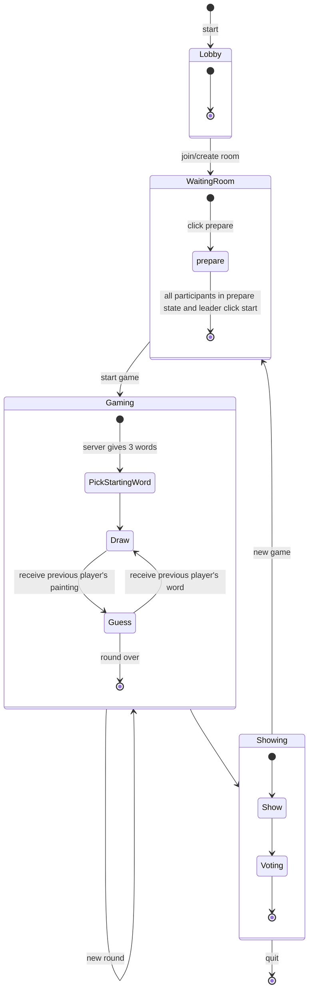
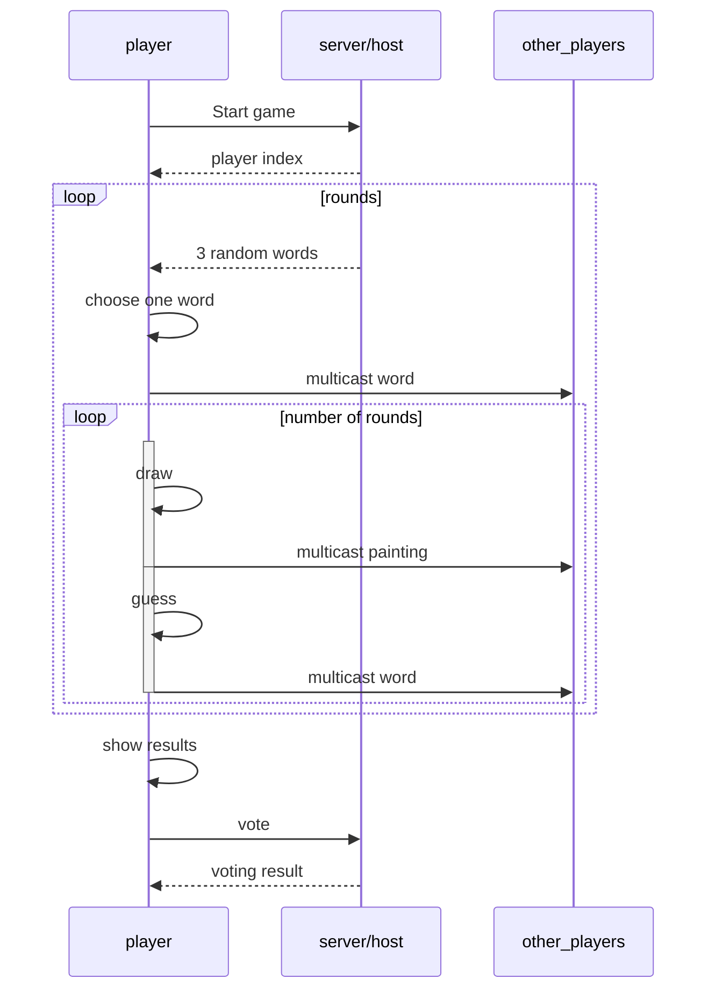

```mermaid
stateDiagram-v2 
	[*] --> Lobby: start
	Lobby --> WaitingRoom: join/create room
	
	state Lobby {
		[*] --> [*]
	}
	
	state WaitingRoom {
		[*] --> prepare: click prepare
		prepare --> [*]: all participants in prepare state and leader click start
	}
	
	state Gaming {
		[*] --> PickStartingWord: server gives 3 words
		PickStartingWord --> Draw
		Draw --> Guess: receive previous player's painting
		Guess --> Draw: receive previous player's word
		Guess -->[*]: round over
	}
	
	state Showing {
		[*] --> Show
		Show --> Voting
		Voting --> [*]
	}
	
	WaitingRoom --> Gaming: start game
	Gaming --> Gaming: new round
	Gaming --> Showing
	Showing --> WaitingRoom: new game
	Showing --> [*]: quit
```

```mermaid
sequenceDiagram
	participant player
	participant server/host
	participant other_players
	
	player ->> server/host: Start game
	server/host -->> player: player index
	loop rounds
    server/host -->> player: 3 random words
    player ->> player: choose one word
    player ->> other_players: multicast word
    loop number of rounds
      activate player
      player ->> player: draw
      player ->> -other_players: multicast painting

      activate player
      player ->> player: guess
      player ->> -other_players: multicast word
    end
	end
	player ->> player: show results
	player ->> server/host: vote
	server/host -->> player: voting result
	
```

```mermaid
sequenceDiagram
	participant player0
	participant player1
	participant player2
	participant player3
	participant server/host
	
	loop rounds
		par
    server/host -->> player0: 3 random words
    and
    server/host -->> player1: 3 random words
    and
    server/host -->> player2: 3 random words
    and
    server/host -->> player3: 3 random words
    end
    par
    player0 ->> player0: choose one word
    and
    player1 ->> player1: choose one word
    and
    player2 ->> player2: choose one word
    and
    player3 ->> player3: choose one word
    end
    par
    player0 ->> player1: multicast word
    player0 ->> player2: multicast word
    player0 ->> player3: multicast word
    and
    player1 ->> player0: multicast word
    player1 ->> player2: multicast word
    player1 ->> player3: multicast word
    and
    player2 ->> player0: multicast word
    player2 ->> player1: multicast word
    player2 ->> player3: multicast word
    and
    player3 ->> player0: multicast word
    player3 ->> player1: multicast word
    player3 ->> player2: multicast word
    end
    loop number of rounds
    	par
      player0 ->> player0: draw
      and
      player1 ->> player1: draw
      and
      player2 ->> player2: draw
      and
      player3 ->> player3: draw
      end
      
      par
      player0 ->> player1: multicast painting
      player0 ->> player2: multicast painting
      player0 ->> player3: multicast painting
      and
      player1 ->> player0: multicast painting
      player1 ->> player2: multicast painting
      player1 ->> player3: multicast painting
      and
      player2 ->> player0: multicast painting
      player2 ->> player1: multicast painting
      player2 ->> player3: multicast painting
      and
      player3 ->> player0: multicast painting
      player3 ->> player1: multicast painting
      player3 ->> player2: multicast painting
      end

			par
      player0 ->> player0: guess
      and
      player1 ->> player1: guess
      and
      player2 ->> player2: guess
      and
      player3 ->> player3: guess
      end
      
      par
      player0 ->> player1: multicast word
      player0 ->> player2: multicast word
      player0 ->> player3: multicast word
      and
      player1 ->> player0: multicast word
      player1 ->> player2: multicast word
      player1 ->> player3: multicast word
      and
      player2 ->> player0: multicast word
      player2 ->> player1: multicast word
      player2 ->> player3: multicast word
      and
      player3 ->> player0: multicast word
      player3 ->> player1: multicast word
      player3 ->> player2: multicast word
      end
    end
	end
	par
  player0 ->> player0: show results
  and
  player1 ->> player1: show results
  and
  player2 ->> player2: show results
  and
  player3 ->> player3: show results
  end
  par
  player0 ->> server/host: vote
  and
  player1 ->> server/host: vote
  and
  player2 ->> server/host: vote
  and
  player3 ->> server/host: vote
  end
  par
	server/host -->> player0: voting result
	and
	server/host -->> player1: voting result
	and
	server/host -->> player2: voting result
	and
	server/host -->> player3: voting result
	end
```

