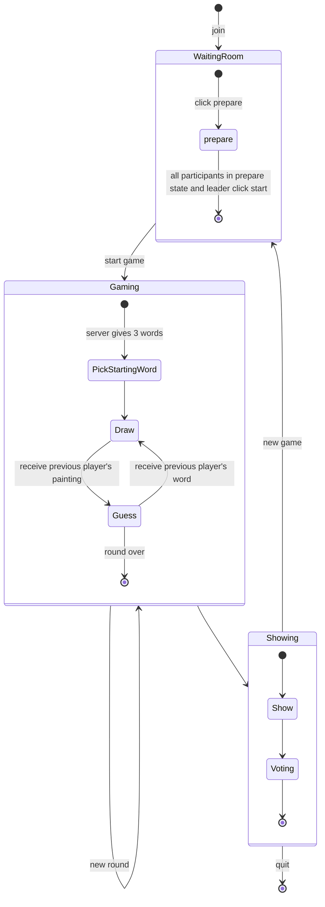

```mermaid
stateDiagram-v2 
	[*] --> WaitingRoom: join
	
	
	state WaitingRoom {
		[*] --> prepare: click prepare
		prepare --> [*]: all participants in prepare state and leader click start
	}
	
	state Gaming {
		[*] --> PickStartingWord: server gives 3 words
		PickStartingWord --> Draw
		Draw --> Guess: receive previous player's painting
		Guess --> Draw: receive previous player's word
		Guess -->[*]: round over
	}
	
	state Showing {
		[*] --> Show
		Show --> Voting
		Voting --> [*]
	}
	
	WaitingRoom --> Gaming: start game
	Gaming --> Gaming: new round
	Gaming --> Showing
	Showing --> WaitingRoom: new game
	Showing --> [*]: quit
```

