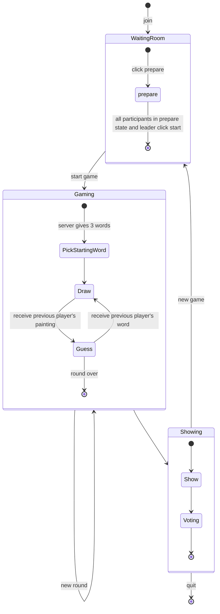
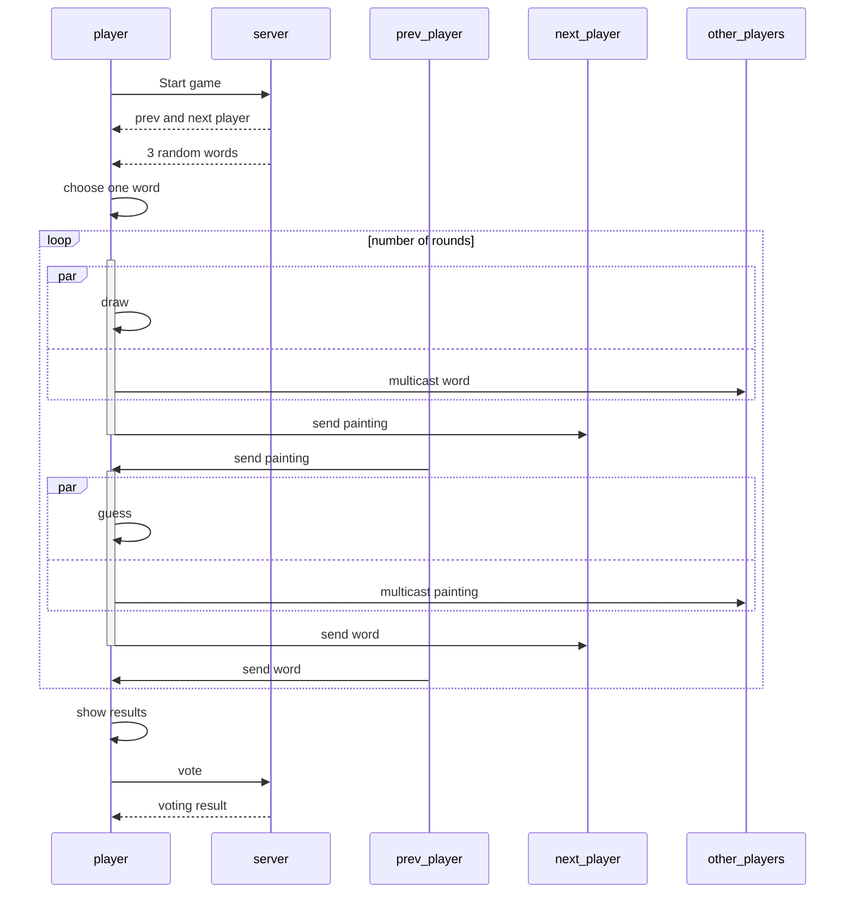

```mermaid
stateDiagram-v2 
	[*] --> WaitingRoom: join
	
	
	state WaitingRoom {
		[*] --> prepare: click prepare
		prepare --> [*]: all participants in prepare state and leader click start
	}
	
	state Gaming {
		[*] --> PickStartingWord: server gives 3 words
		PickStartingWord --> Draw
		Draw --> Guess: receive previous player's painting
		Guess --> Draw: receive previous player's word
		Guess -->[*]: round over
	}
	
	state Showing {
		[*] --> Show
		Show --> Voting
		Voting --> [*]
	}
	
	WaitingRoom --> Gaming: start game
	Gaming --> Gaming: new round
	Gaming --> Showing
	Showing --> WaitingRoom: new game
	Showing --> [*]: quit
```

```mermaid
sequenceDiagram
	participant player
	participant server
	participant prev_player
	participant next_player
	participant other_players
	
	player ->> server: Start game
	server -->> player: prev and next player
	server -->> player: 3 random words
	player ->> player: choose one word
	loop number of rounds
	activate player
		par
		player ->> player: draw
		and
		player ->> other_players: multicast word
		end
		player ->> -next_player: send painting
		prev_player ->> player: send painting
		activate player
		par
		player ->> player: guess
		and
		player ->> other_players: multicast painting
		end
		player ->> -next_player: send word
		prev_player ->> player: send word
	end
	player ->> player: show results
	player ->> server: vote
	server -->> player: voting result
	
```

