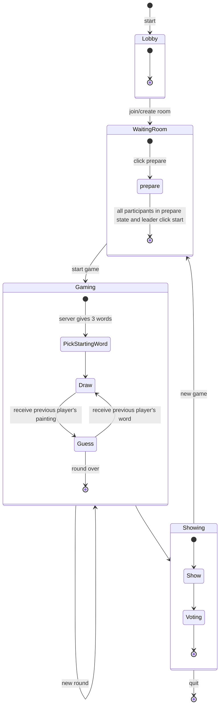
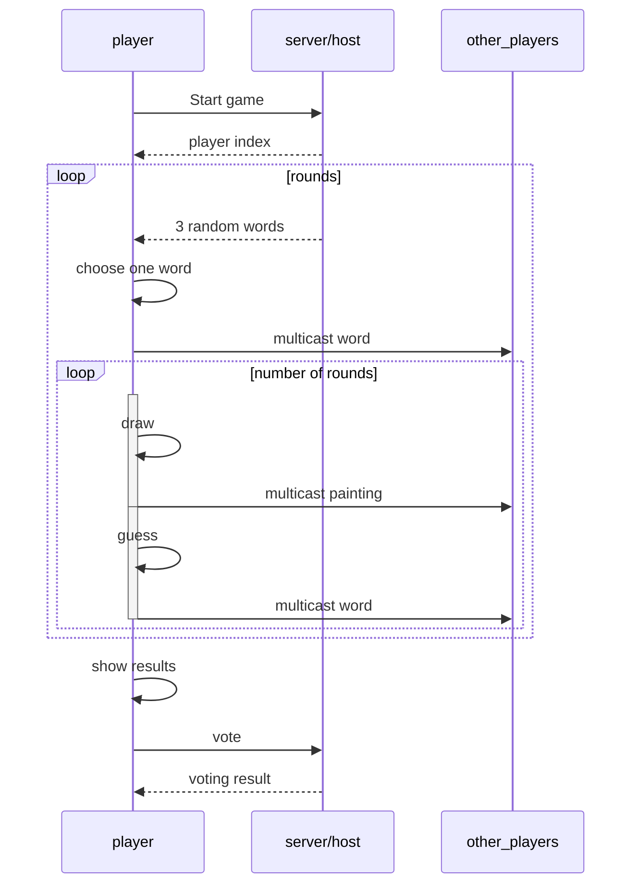

```mermaid
stateDiagram-v2 
	[*] --> Lobby: start
	Lobby --> WaitingRoom: join/create room
	
	state Lobby {
		[*] --> [*]
	}
	
	state WaitingRoom {
		[*] --> prepare: click prepare
		prepare --> [*]: all participants in prepare state and leader click start
	}
	
	state Gaming {
		[*] --> PickStartingWord: server gives 3 words
		PickStartingWord --> Draw
		Draw --> Guess: receive previous player's painting
		Guess --> Draw: receive previous player's word
		Guess -->[*]: round over
	}
	
	state Showing {
		[*] --> Show
		Show --> Voting
		Voting --> [*]
	}
	
	WaitingRoom --> Gaming: start game
	Gaming --> Gaming: new round
	Gaming --> Showing
	Showing --> WaitingRoom: new game
	Showing --> [*]: quit
```

```mermaid
sequenceDiagram
	participant player
	participant server/host
	participant other_players
	
	player ->> server/host: Start game
	server/host -->> player: player index
	loop rounds
    server/host -->> player: 3 random words
    player ->> player: choose one word
    player ->> other_players: multicast word
    loop number of rounds
      activate player
      player ->> player: draw
      player ->> -other_players: multicast painting

      activate player
      player ->> player: guess
      player ->> -other_players: multicast word
    end
	end
	player ->> player: show results
	player ->> server/host: vote
	server/host -->> player: voting result
	
```

